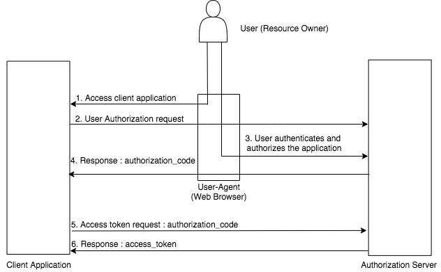

# Authorization Code Grant Type

### Recommended Use

The **authorization code** grant type is optimized for [confidential clients](client-types.md).
It provides a few important security benefits such as;

- It can authenticate the client.

- It can transmit the access token directly to the client without passing it through the resource owner’s user-agent.

This grant type is suitable when the resource owner is a user and the client is a website.

### How does it work ?

The client directs the resource owner to an authorization server, instead of requesting authorization directly from the 
resource owner. The resource owner is then redirected back to the client with the authorization code which the client 
will capture and exchange for an access token in the background. Since this is a redirection-based flow, the client 
must be able to interact with the resource owner's user-agent and receive incoming requests (via redirection) from the 
authorization server.

The diagram below illustrates the authorization code flow.

!!! info "Support for refresh token grant - Yes"
	This grant type issues a refresh token which can be used to obtain new access tokens using the [refresh token grant](../../learn/refresh-token-grant).

